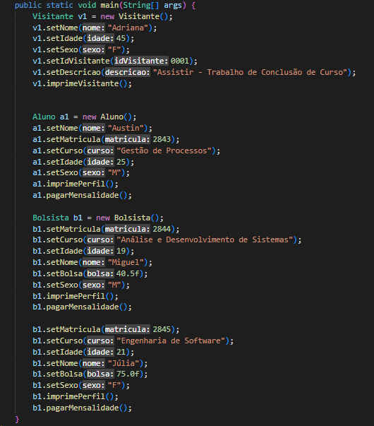
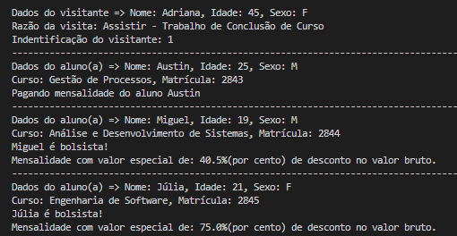

## Código - Gerenciador de instituições de ensino 🏫👨🏽‍🎓

  

### Java POO - Curso em Vídeo ☕▶

Código desenvolvido na aula 11 do Curso em Vídeo - Java POO. Com esse projeto podemos gerenciar os estudantes de uma determinada instituição de ensino, bem como ter o controle dos visitantes que participam de alguma atividade dentro da instituição.

  
## Compilação 👨🏽‍💻

### Inserindo dados no sistema 💻⬅

  

### Tela após compilação ▫▪▫

  

<strong>Características do Programa</strong>

- [x] O programa vai exibir os dados complexos de cada aluno e dados necessários de visitantes quando houver
- [x] Mostra o valor do desconto que o bolsista possuí, além dos outros atributos necessários para identificação

## Tecnologias 🛠

- Java POO ☕

## Instrutor 👨🏽‍🏫
- <a target="_blank" href="https://www.linkedin.com/in/guanabara/">Gustavo Guanabara</a>

## Aluno 👨🏽‍🎓

- <a target="_blank" href="https://www.linkedin.com/in/ramon-barreto-076191180/">Ramon Barreto</a>

## Contato 📲

- Email: ramon_barreto_medrado@hotmail.com